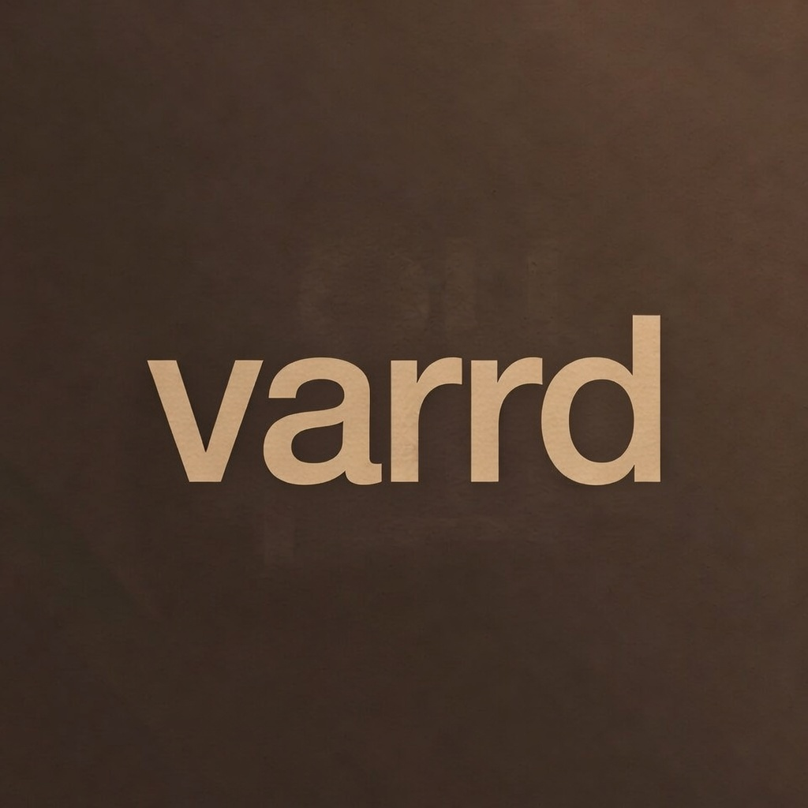
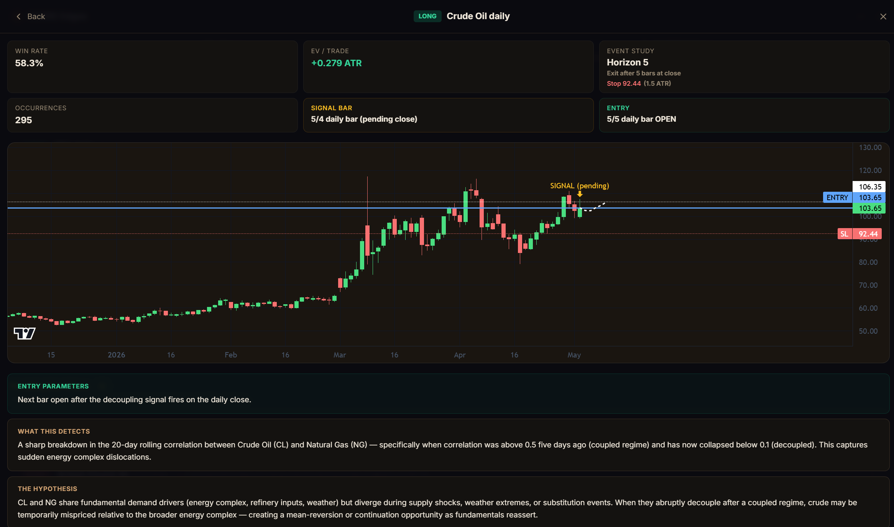
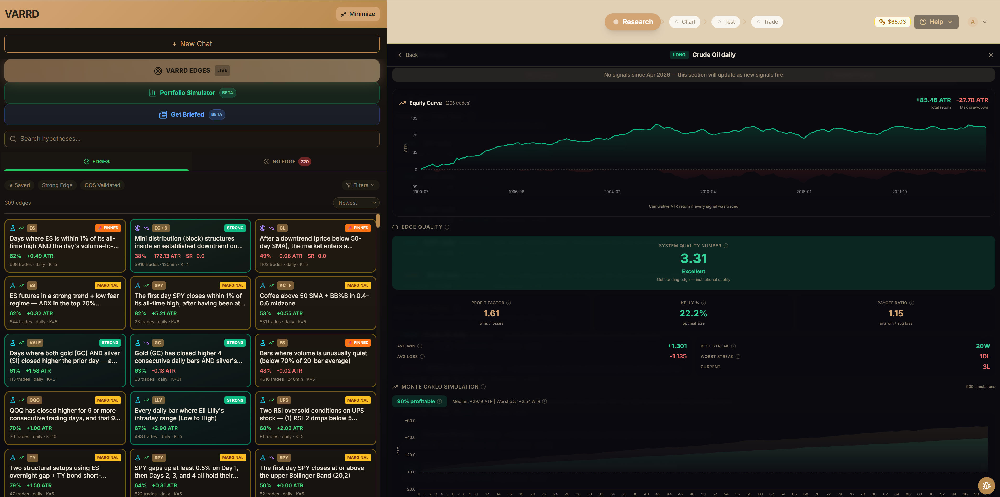

<p align="center">
  
</p>

<p align="center">
  <strong>The governed live edge layer.</strong><br/>
  Statistically validated market behaviors, monitored in real time.
</p>

<p align="center">
  <a href="https://pypi.org/project/varrd/"></a>
  <a href="https://app.varrd.com/mcp"></a>
  <a href="https://app.varrd.com/mcp"></a>
  <a href="LICENSE"></a>
</p>

<p align="center">
  <a href="https://app.varrd.com">Web App</a> · <a href="https://app.varrd.com/mcp">MCP Endpoint</a> · <a href="https://pypi.org/project/varrd/">PyPI</a> · <a href="https://www.varrd.com">varrd.com</a>
</p>

---

<p align="center">
  
</p>

<p align="center">
  <em>Every edge shows exact entry, stop, target, and the full statistical methodology behind it.</em>
</p>

<p align="center">
  
</p>

<p align="center">
  <em>Equity curves, Monte Carlo simulations, regime analysis, edge decay, and full audit trail.</em>
</p>

---

## Two ways to use VARRD

**1. Tell your AI.** Add the MCP config below, then ask: *"What VARRD edges are firing right now?"* or *"What happens to gold when silver ETFs are making 100-day new lows?"* Your AI browses the edge library, shows you what's actionable, and can test any idea you throw at it.

**2. Use the web app.** Go to [app.varrd.com](https://app.varrd.com), sign up, and do the same thing — browse the edge library, ask questions like *"Is there a seasonal pattern in wheat before harvest?"*, and watch the full research pipeline run visually.

```json
{
  "mcpServers": {
    "varrd": { "url": "https://app.varrd.com/mcp" }
  }
}
```

Works with Claude Desktop, Cursor, OpenBB, or any MCP client. No API key needed.

---

## What VARRD does

VARRD turns trading ideas into quantitative formulas using a domain-specific language we built from the ground up — purpose-built to express market behaviors in a way that's both machine-testable and human-readable. Those formulas are then tested with the right guardrails so the results actually mean something.

The AI generates hypotheses. **A purpose-built backtesting engine does the math.** The AI never calculates statistics, never fabricates results, and never touches the numbers. Every stat comes from a deterministic computation running in a sandboxed kernel. This matters because most people's first question is: *"How do I know the AI isn't just making this up?"* It can't. The engine is separate from the model.

VARRD also maintains a growing library of validated edges — patterns that survived the full testing gauntlet — running 24/7 against live market data across futures, equities, and crypto. When an edge fires, you get exact entry, stop, target, hold period, and the complete audit trail of how it was discovered, tested, and validated.

---

## Full transparency

Every edge in the library shows you everything. Not summaries — the actual work.

**How it was found:** The discovery story — what pattern was hypothesized, why it might work, what market structure theory it's based on. You can read the exact thinking that led to the formula.

**The formula itself:** Written in our domain-specific language built to quantify market behaviors and make them replicable. You can read every condition, understand the logic, and verify there's no data leak or circular reasoning. The setup code and the boolean formula are both visible.

**How it was tested:** Per-horizon results showing win rate, expected value, p-value, and signal count at every hold period tested. K-tracking shows how many tests were run on this hypothesis — and every test is fingerprinted so you can't re-run the same thing hoping for a better number. Vectorized embeddings with cosine similarity detect when a new hypothesis overlaps with one already tested — if you're just tweaking the same idea, the system catches it and penalizes accordingly. Lookahead verification confirms signals reproduce on truncated data.

**How it's performing now:** Post-discovery performance tracked separately from in-sample. Edge decay by quarter. Rolling stability. Regime analysis (how it performs in low vol, high vol, uptrends, downtrends). Monte Carlo simulation. Drawdown analysis. The full picture — not just a win rate.

**The interactive view:** Every edge has a browser link that shows the chart with every signal marked, the equity curve, the full performance dashboard, and the discovery story. Share it with anyone — no account needed.

If an edge is decaying, you see it. If the post-discovery performance doesn't match in-sample, you see it. If it only works in bull markets, you see it. Nothing is hidden.

---

## What the guardrails prevent

| Problem | How it happens | VARRD's guard |
|---------|---------------|---------------|
| **Overfitting** | Tweak until it looks good on history | OOS is sacred — one shot, permanently locked |
| **Cherry-picking** | Test 50 variants, show the winner | K-tracking counts every test, adjusts significance |
| **p-hacking** | Massage until "significant" | Bonferroni correction, fingerprinted tests |
| **Duplicate testing** | Reword the same idea to dodge K | Cosine similarity on vectorized embeddings detects overlapping hypotheses |
| **Lookahead bias** | Future data leaks into formula | Sandbox kernel + automated truncated-data verification |
| **OOS contamination** | Peek at holdout, then "validate" | Once used, permanently locked. No re-runs. |
| **Fabricated stats** | AI invents numbers | Engine computes, AI interprets. Separate systems. |
| **Slippage ignored** | Backtest assumes perfect fills | ATR-normalized returns account for volatility regime |
| **Commission ignored** | Gross returns look great, net don't | Explicit in backtest engine, factored into P&L |

---

## What you get at each tier

### Free — which markets have edges firing

See which markets have validated edges that are firing right now, pending bar close, or in active trades. Markets and status only — no direction, no stats, no trade levels.

```
VARRD Edge Library — 3 firing, 12 pending bar close, 35 in active trades

FIRING (actionable now):
  AAPL daily — 798c0e5f-4c71-453c-a168-fc3b0771e506
  Crude Oil daily — 9d713707-4548-462e-a787-676e56ec3a0b
  Gold daily — 081ab7f2-edfb-4f74-add8-6fc90aca3561

$0.50: unlock direction, win rate, EV, stop/target, entry date for ALL edges (depth=1)
$1/edge or $5/all: full formula, methodology, performance analytics (depth=2)
```

### $0.50 — 15-minute snapshot of all active edges

Unlocks direction, win rate, EV, stops, entry date, and hold period for every firing, pending, and active edge. This is a 15-minute window — a snapshot of what's live right now.

```
  NQ daily LONG | FIRING — enter 2026-05-04 OPEN
    64% win | 0.51 EV | 1419 signals | stop $27,200 target $29,785 | hold 10
    "NQ 13-day ROC positive 5 days then declining, weekly RSI > 55"
```

### $1/edge — full audit trail

The complete methodology for one edge. TRADE details, PERFORMANCE with post-discovery tracking, INTEGRITY (K-tracking, lookahead verification, beats-market), DISCOVERY story, FORMULA in our domain-specific language, and drill-down sections:

- **horizons** — Win rate, EV, p-value, signal count at every hold period
- **analytics** — SQN, profit factor, Kelly %, Monte Carlo, drawdown, regime analysis, edge decay
- **occurrences** — Every historical signal with date and ATR return
- **setup_code** — Full source code in our DSL (auditable)
- **view** — Interactive chart + discovery story link for your user

```
EDGE QUALITY
  SQN: 6.46 (Excellent)
  Profit Factor: 1.66
  Kelly %: 25.4%
  Best Streak: 25W · Worst Streak: 16L

MONTE CARLO
  500 simulations · 98% profitable
  Median: +44.49 ATR · Worst 5%: +8.56 ATR

REGIME ANALYSIS
  Low Vol (VIX < 15)    59% WR · +0.38 ATR
  Normal (VIX 15-25)    66% WR · +0.54 ATR
  High Vol (VIX > 25)   75% WR · +1.07 ATR
```

### $5 — everything on every edge

Full audit trail on every active edge in the library. Same depth as the $1 tier, but for all of them.

---

## Python SDK

```bash
pip install varrd
```

```python
from varrd import VARRD

v = VARRD()

# Browse the edge library
edges = v.edges()                              # free — which markets are firing
edges = v.edges(depth=1)                       # $0.50 — snapshot with stats + levels
edges = v.edges(depth=1, direction="SHORT")    # filter by direction
edges = v.edges(depth=1, asset_class="futures") # filter by asset class
edges = v.edges(depth=2, edge_id="abc123")     # $1 — full audit trail

# Research your own ideas
r = v.research("When RSI drops below 25 on ES, is there a bounce?")
r = v.research("test it", session_id=r.session_id)
print(r.context.edge_verdict)  # "STRONG EDGE" / "NO EDGE"

# Autonomous discovery
result = v.discover("mean reversion on futures")

# Morning briefing
b = v.briefing()
print(b.news)
```

## CLI

```bash
varrd edges                                    # free — which markets are firing
varrd edges --depth 1                          # $0.50 — snapshot with stats + levels
varrd edges --depth 2 --edge-id abc123         # $1 — full audit trail
varrd research "Does buying SPY after 3 down days work?"
varrd discover "momentum on grains"
varrd briefing
```

---

## Questions VARRD can answer

These are real things you can ask. VARRD loads the data, builds the formula, tests it statistically, and tells you if there's an edge.

> *"Is there an edge to going long Starbucks on their Red Cup Day?"*

> *"What happens to gold futures when yen and 10-year bonds make 20-day new highs on the same day?"*

> *"Take a look at crude oil on a 240-minute timeframe right now — diagnose how it's acting and let's find every time it's happened in the past and if there's an edge."*

> *"Does it test out to short fast food companies during Lent?"*

> *"What happens to Bitcoin after a halving event?"*

> *"When corn and soybeans diverge by more than 2 standard deviations, is there a mean reversion trade?"*

Every question becomes a hypothesis, gets charted with real data, statistically tested with proper guardrails (Bonferroni correction, K-tracking, lookahead verification), and produces a clear verdict: edge or no edge. Both answers are valuable.

---

## Data coverage

| Asset Class | Markets | Timeframes |
|-------------|---------|------------|
| **Futures (CME)** | 35 markets (ES, NQ, CL, GC, SI, ZC, ZW, NG, ...) | 1h through weekly, back to 1985 |
| **Equities** | Any US stock or ETF (12,600+ tickers) | 1h through weekly |
| **Crypto** | BTC, ETH, SOL and more | 1h through weekly |

---

## MCP tools

| Tool | What it does |
|------|-------------|
| `varrd_edges` | Browse the validated edge library with filters |
| `varrd_ai` | Multi-turn research — test any trading idea |
| `autonomous_varrd_ai` | Autonomous discovery — VARRD finds edges for you |
| `search` | Search your saved strategies |
| `get_hypothesis` | Full detail on your own strategy |
| `check_balance` | Credit balance + auto-detects completed payments |
| `buy_credits` | Card (Stripe Checkout) or USDC on Base (autonomous) |
| `get_briefed` | Personalized market news tied to your edge library |
| `reset_session` | Kill a stuck research session |

---

## Pricing

| What | Cost | Duration |
|------|------|----------|
| See which markets have edges firing | Free | — |
| Snapshot: stats + trade levels on all active edges | $0.50 | 15 minutes |
| Full audit trail on one edge | $1 | Permanent |
| Full audit trail on every edge | $5 | 15 minutes |
| Research your own ideas | ~$0.25 | Per query |
| Autonomous discovery | ~$1 | Per idea |

Sign up at [app.varrd.com](https://app.varrd.com) for $2 in free credits.

---

## Why this exists

Finding edges is not hard. Finding **non-data-mined edges** with proper precautions at every step is much harder.

An LLM by itself will happily write you a backtest, show you a beautiful equity curve, and tell you it has a 70% win rate. The problem: none of it is real. The LLM doesn't have market data, doesn't have a testing environment, and has no guardrails preventing it from overfitting, cherry-picking, or fabricating numbers.

**An LLM is a brain without a lab.** It can reason about trading ideas, but it can't test them in a controlled environment. VARRD is the lab — purpose-built infrastructure where every test is tracked, every result is verified, and the dozen ways to accidentally cheat are blocked at the system level, not the prompt level.

And if you still aren't convinced — we show you everything. The formula, the code, the test results at every horizon, the post-discovery performance, the regime sensitivity, the Monte Carlo simulation, and every single historical occurrence. Full transparency. Audit it yourself.

---

<p align="center">
  <em>"No edge found" is a result, not a failure. Knowing what doesn't work is as valuable as knowing what does.</em>
</p>

<p align="center">
  Built by a team from one of the most successful derivatives firms in Chicago history,<br/>alongside Princeton graduates and AI engineers. NVIDIA Inception member.
</p>
