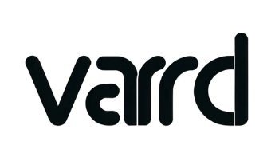

<p align="center">
  
</p>

<p align="center">
  <strong>The governed live edge layer.</strong><br/>
  Statistically validated market behaviors, monitored in real time.
</p>

<p align="center">
  <a href="https://pypi.org/project/varrd/"></a>
  <a href="https://app.varrd.com/mcp"></a>
  <a href="https://app.varrd.com/mcp"></a>
  <a href="https://app.varrd.com"></a>
  <a href="LICENSE"></a>
</p>

<p align="center">
  <a href="https://app.varrd.com">Web App</a> · <a href="https://app.varrd.com/mcp">MCP Endpoint</a> · <a href="https://pypi.org/project/varrd/">PyPI</a> · <a href="https://www.varrd.com">Landing Page</a>
</p>

---

<p align="center">
  
</p>

<p align="center">
  <em>Every edge shows exact entry, stop, target, and the full statistical methodology behind it.</em>
</p>

<p align="center">
  
</p>

<p align="center">
  <em>300+ validated edges with equity curves, Monte Carlo simulations, regime analysis, and edge decay tracking.</em>
</p>

---

Sample size. Out-of-sample performance. Decay. Regime sensitivity. Execution context. Every edge fully transparent, auditable, and machine-readable.

Built by a team from one of the most successful derivatives firms in Chicago history, alongside Princeton graduates and AI engineers. NVIDIA Inception member. Validated by quants across the country.

---

## Connect your AI in 10 seconds

```json
{
  "mcpServers": {
    "varrd": { "url": "https://app.varrd.com/mcp" }
  }
}
```

Then just ask: *"What trading edges are firing right now?"*

Your AI browses 300+ validated edges, shows you the ones that are actionable, and can drill into the full methodology, performance, and risk on any edge you're interested in.

---

## What VARRD does

VARRD maintains a library of **300+ trading edges** — patterns discovered through rigorous statistical testing, running 24/7 against live market data across futures, equities, and crypto.

Every edge in the library is:
- **Bonferroni-corrected** — significance adjusted for every test ever run
- **K-tracked** — every test fingerprinted, no cherry-picking possible
- **Lookahead-verified** — signals reproduced on truncated data to confirm no future leak
- **ATR-normalized** — returns comparable across any market at any price level
- **Tested against market drift** — not just "does it go up?" but "does it beat the market?"
- **Post-discovery monitored** — real out-of-sample performance tracked from day one

When an edge fires, you get exact entry, stop, target, hold period, and the full methodology behind it.

---

---

## What your AI sees

### Free — what's live right now

```
VARRD Edge Library — 12 firing, 0 pending, 38 in active trades

FIRING (actionable now):
  CL daily  — 9d713707-4548-462e-a787-676e56ec3a0b
  ES daily  — f5413c2c-5241-4760-bfd3-24cebcf5e2b9
  AAPL daily — 798c0e5f-4c71-453c-a168-fc3b0771e506
  NQ daily  — 392979b1-d8dc-4b38-8b0c-13caca1aeaf8
  ...
```

### $0.50 — direction, stats, trade levels

```
  392979b1... | NQ daily LONG | FIRING — enter 2026-05-04 OPEN
    64% win | 0.51 EV | 1419 signals | hold 10
    "NQ 13-day ROC positive 5 days then rolling over, weekly RSI > 55"
```

The AI knows: buy NQ at Monday's open, hold 10 bars, 64% win rate across 1,419 historical signals.

### $1/edge — full methodology + performance

```
TRADE
  Type: event_study
  Signal bar: 2026-05-01 daily bar (confirmed)
  Entry: next daily bar OPEN
  Exit: after 10 bars at close (horizon-based)

PERFORMANCE
  Win Rate: 63.9%  ·  EV/Trade: +0.505 ATR  ·  p-value: 0.0012
  POST-DISCOVERY: 5 live signals, 60% win rate (holding steady)

INTEGRITY
  Tests run (K): 5
  Lookahead bias: NONE — verified (5 sampled signals reproduced)
  Beats market baseline: Yes

FORMULA
  df['roc_positive_5d'] & df['roc_declining'] & (df['weekly_rsi21'] > 55)
```

Plus drill-down sections (free after purchase):

```
section=horizons     →  Win rate, EV, p-value at every hold period
section=analytics    →  SQN, profit factor, Kelly %, Monte Carlo,
                        drawdown, regime analysis, edge decay
section=occurrences  →  Every signal with date and ATR return
section=setup_code   →  Full Python source (auditable)
section=view         →  Interactive chart link for your user
```

### Full performance analytics

When you pay $1 for an edge, `section=analytics` gives you everything a quant would want:

```
EDGE QUALITY
  SQN: 6.46 (Excellent)
  Profit Factor: 1.66
  Kelly %: 25.4%
  Payoff Ratio: 0.93
  Best Streak: 25W · Worst Streak: 16L

DRAWDOWN
  Total Return: +457.58 ATR
  Max Drawdown: -49.70 ATR (18 trades)
  Recovery Factor: 9.21

MONTE CARLO
  500 simulations · 98% profitable
  Median final: +44.49 ATR
  Worst 5%: +8.56 ATR

REGIME ANALYSIS
  Low Vol (VIX < 15)    59% WR · +0.38 ATR · n=591
  Normal (VIX 15-25)    66% WR · +0.54 ATR · n=725
  High Vol (VIX > 25)   75% WR · +1.07 ATR · n=119

EDGE DECAY (by quarter)
  Q4 2017    87% WR · +2.622 ATR · n=23
  Q1 2018    32% WR · -2.467 ATR · n=19
  Q2 2024    88% WR · +2.424 ATR · n=16
  Q1 2026    67% WR · +0.822 ATR · n=3
```

Every edge. Full transparency. The AI can explain the risk, the regime sensitivity, the decay pattern, and whether you should actually take the trade.

---

## Interactive view links

Every edge purchase includes a temporary browser link your user can open:

```
https://app.varrd.com/edge/view/d82ffba21d4940ac
```

Shows the full chart with signals marked, the discovery story, performance metrics, equity curve, Monte Carlo simulation, regime breakdown, and every historical occurrence. No account needed. Expires in 15 minutes.

This is how you show your user the work — not just stats, but the full audit trail of how the edge was found, tested, and validated.

---

## Why this exists

Finding edges is not hard. Finding **non-data-mined edges** with proper precautions at every step is much harder.

An LLM by itself will happily write you a backtest, show you a beautiful equity curve, and tell you it has a 70% win rate. The problem: none of it is real. The LLM doesn't have market data, doesn't have a testing environment, and has no guardrails preventing it from overfitting, cherry-picking, or fabricating numbers.

**What can go wrong — and what VARRD handles:**

| Problem | How it happens | VARRD's guard |
|---------|---------------|---------------|
| **Overfitting** | Tweak until it looks good on history | Out-of-sample is sacred — one shot, permanently locked |
| **Cherry-picking** | Test 50 variants, show the winner | K-tracking counts every test, adjusts significance |
| **p-hacking** | Massage until "significant" | Bonferroni correction, fingerprinted tests |
| **Lookahead bias** | Future data leaks into formula | Sandbox kernel + automated truncated-data verification |
| **Fabricated stats** | LLM invents numbers | Every stat from deterministic computation, never generated |
| **No OOS** | Backtest only, never validated | Post-discovery tracking from day one |

As Terence Tao said, idea generation is no longer the bottleneck — validation is. We have tested tens of thousands of hypotheses grounded in literature from the best investors and traders in history. These edges are the only ones that survived the gauntlet.

---

## Python SDK

```bash
pip install varrd
```

```python
from varrd import VARRD

v = VARRD()

# Browse the edge library
edges = v.edges()                              # free — what's firing
edges = v.edges(depth=1)                       # $0.50 — stats + trade levels
edges = v.edges(depth=1, direction="SHORT")    # filter by direction
edges = v.edges(depth=1, asset_class="futures") # filter by asset class
edges = v.edges(depth=2, edge_id="abc123")     # $1 — full methodology

# Research your own ideas
r = v.research("When RSI drops below 25 on ES, is there a bounce?")
r = v.research("test it", session_id=r.session_id)
r = v.research("show me the trade setup", session_id=r.session_id)
print(r.context.edge_verdict)  # "STRONG EDGE" / "NO EDGE"

# Autonomous discovery
result = v.discover("mean reversion on futures")

# Morning briefing
b = v.briefing()
print(b.news)

# Check balance
print(v.balance())
```

## CLI

```bash
# Browse the edge library
varrd edges                                    # free — what's firing
varrd edges --depth 1                          # $0.50 — stats + levels
varrd edges --depth 1 --direction SHORT        # filter
varrd edges --depth 2 --edge-id abc123         # $1 — full methodology

# Research your own ideas (auto-follows workflow)
varrd research "Does buying SPY after 3 down days work?"

# Autonomous discovery
varrd discover "momentum on grains"

# Morning briefing
varrd briefing

# Balance + buy credits
varrd balance
varrd buy-credits
```

---

## Data coverage

| Asset Class | Markets | History | Timeframes |
|-------------|---------|---------|------------|
| **Futures (CME)** | 35 markets (ES, NQ, CL, GC, SI, ZC, ZW, NG, ...) | 1985–present | 1h, 2h, 4h, 6h, 8h, 12h, daily, weekly |
| **Equities** | Any US stock or ETF (12,600+ tickers) | Full history | 1h, 2h, 4h, 6h, daily, weekly |
| **Crypto** | BTC, ETH, SOL and more | Full history | 1h, 2h, 4h, daily, weekly |

---

## Pricing

| Tier | Cost | What you get |
|------|------|-------------|
| **Browse** | Free | Which markets have edges firing, pending, or in active trades |
| **Stats** | $0.50 | Direction, win rate, EV, stops, entry date for ALL active edges |
| **Single edge** | $1 | Full methodology, formula, performance, integrity, interactive view |
| **All edges** | $5 | Everything on every edge |
| **Research** | ~$0.25/query | Test your own ideas with VARRD AI |
| **Autonomous** | ~$1/idea | Let VARRD discover and test edges for you |

Sign up at [app.varrd.com](https://app.varrd.com) for $2 in free credits.

---

## MCP tools

| Tool | Cost | What it does |
|------|------|-------------|
| `varrd_edges` | Free/$0.50/$1/$5 | Browse the validated edge library with filters |
| `varrd_ai` | Credits | Multi-turn research — test any trading idea |
| `autonomous_varrd_ai` | Credits | Autonomous discovery — VARRD finds edges for you |
| `search` | Free | Search your saved strategies |
| `get_hypothesis` | Free | Full detail on your own strategy |
| `check_balance` | Free | Credit balance + auto-detects completed payments |
| `buy_credits` | Free | Stripe Checkout (card) or USDC on Base (autonomous) |
| `get_briefed` | Credits | Personalized market news tied to your edge library |
| `reset_session` | Free | Kill a stuck research session |

---

## How edges are tested

```
1. Idea → VARRD AI generates a formula from market structure knowledge
2. Chart → Pattern marked on decades of market data
3. Test  → Event study or backtest with proper controls
4. Validate → Bonferroni correction, beats-market test, lookahead check
5. Monitor → Scanner runs 24/7, tracks post-discovery performance
6. Decay  → Edge quality monitored over time, regime-aware
```

Every edge shows you:
- **How it was found** (the discovery story)
- **What it tests** (the formula and setup code — auditable Python)
- **Whether it's real** (p-value, K-tracking, lookahead verification)
- **How it's doing now** (post-discovery win rate, edge decay, regime analysis)
- **Whether you should trade it** (SQN, Monte Carlo, drawdown, stability)

---

## Links

- **Web app**: [app.varrd.com](https://app.varrd.com)
- **MCP endpoint**: `https://app.varrd.com/mcp`
- **Landing page**: [varrd.com](https://www.varrd.com)
- **PyPI**: [pypi.org/project/varrd](https://pypi.org/project/varrd/)

---

*"No edge found" is a result, not a failure. Knowing what doesn't work is as valuable as knowing what does.*
